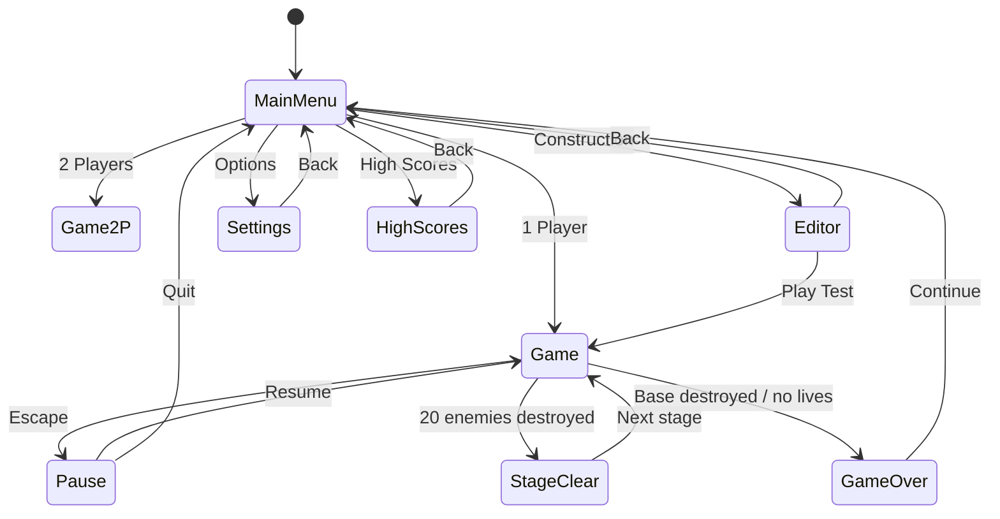

# Screen Flow

## Screens

| Screen | Route | Description |
|--------|-------|-------------|
| MainMenu | `/` | Title, mode select |
| Game | `/game` | Active gameplay + HUD |
| Game2P | `/game?mode=2p` | Co-op gameplay |
| Editor | `/editor` | Level construction |
| Settings | `/settings` | Audio, difficulty, controls |
| HighScores | `/scores` | Top 10 local scores |

## Overlays (in-game)

- Pause menu (semi-transparent)
- Stage clear banner
- Game over screen
- Countdown before stage start (optional)

## HUD Elements

- P1 score (top-left)
- P2 score (top-right, 2P only)
- Lives remaining (tank icons)
- Enemies remaining (icon + count)
- Current stage number
- Power-up timer indicators
